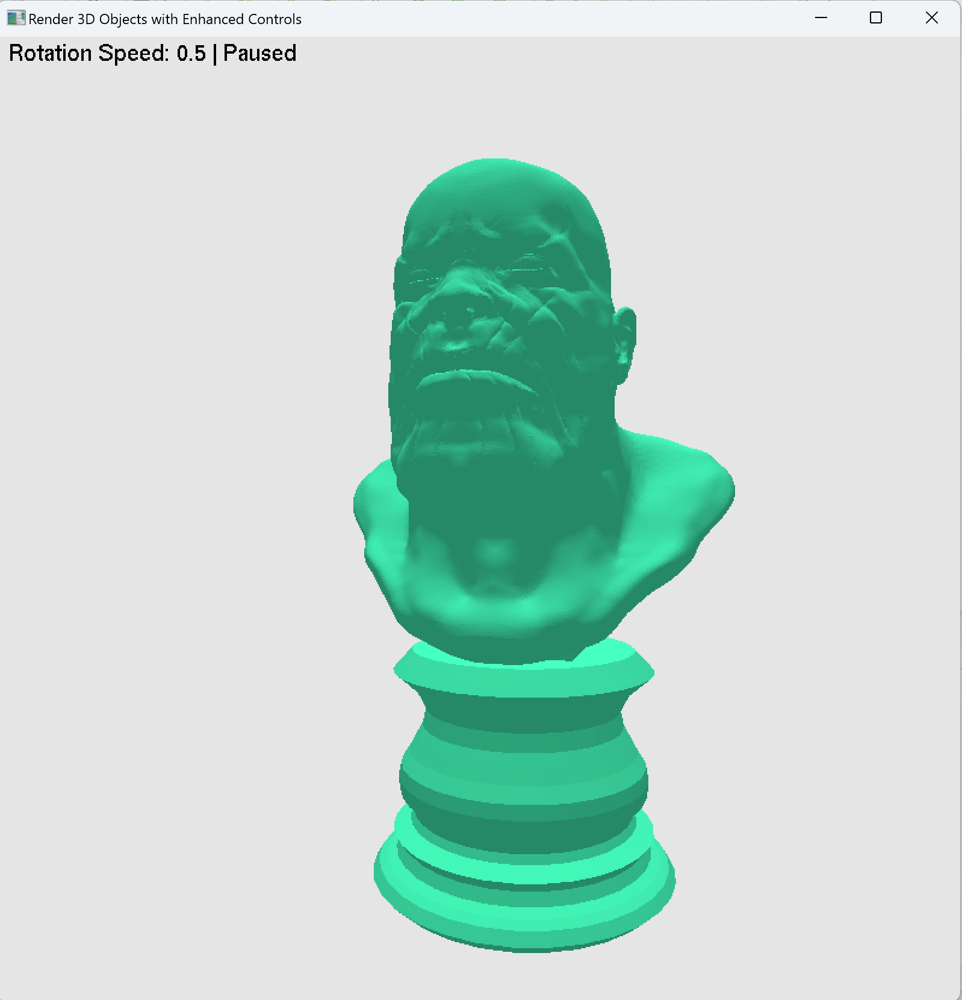
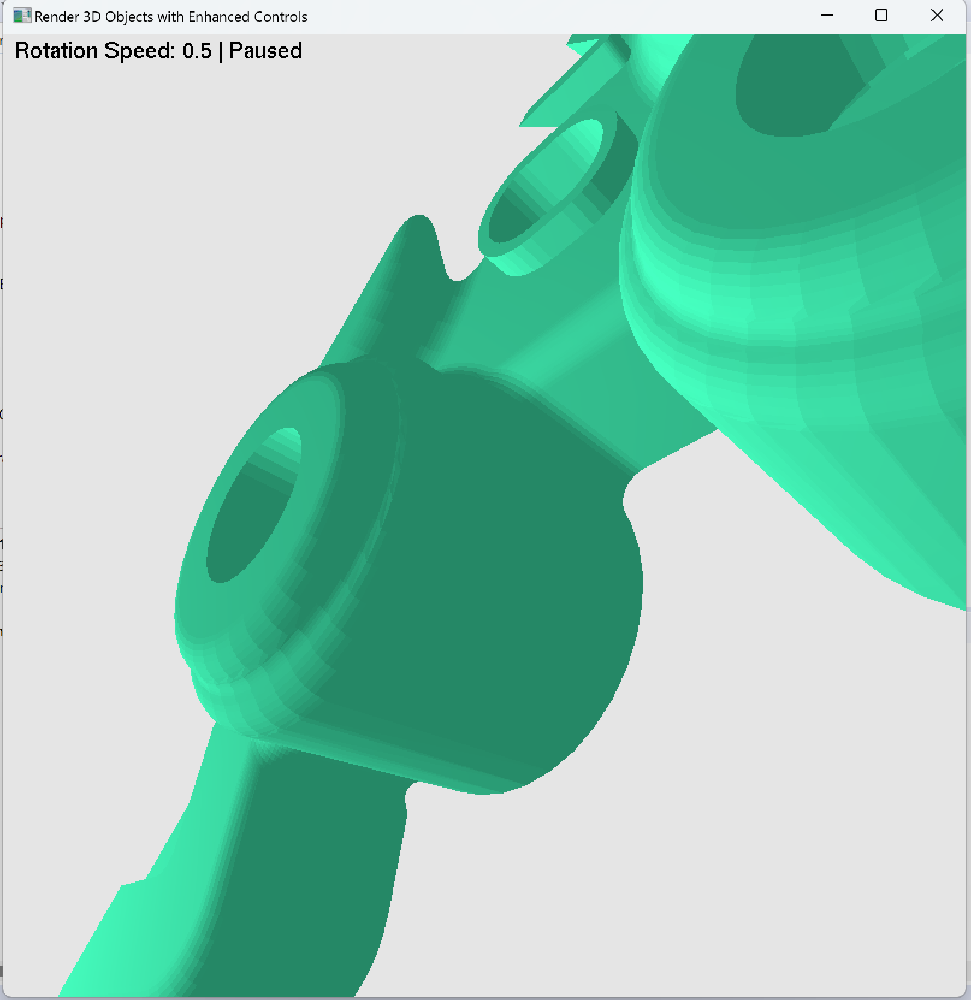
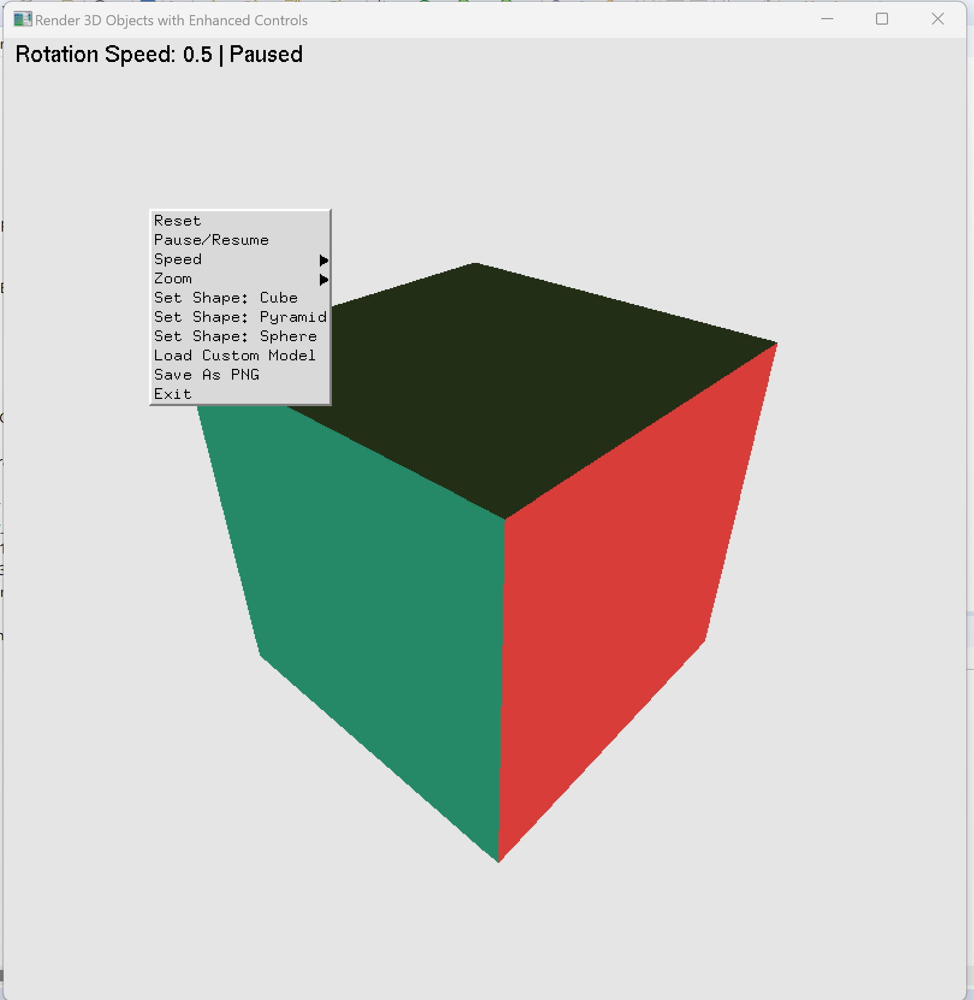
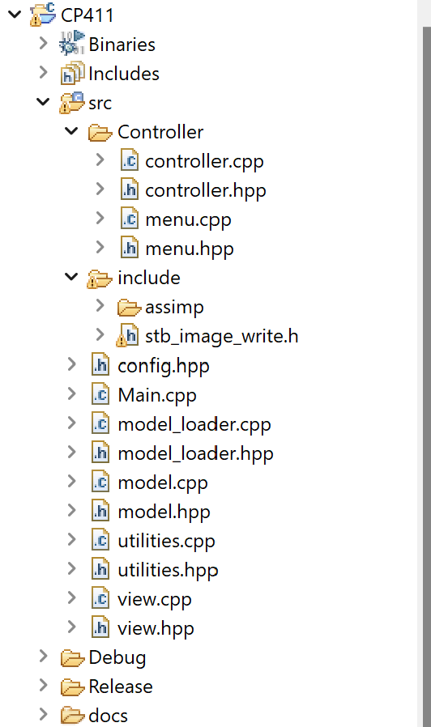

# PROJECT Report

Author: Jashandeep Singh

Date: 1 December 2024 

Check [readme.txt](readme.txt) for course work statement and self-evaluation. 
  

## R1 Proposal (proposal)

### R1.1 Application problem description
 

Complete? (Yes) 

Include the proposal in submission package and add link to the proposal. 

	

### R1.2 Creativity/new features
 

Complete? (Yes) 

Application provides an interactive platform for rendering and manipulating 3D shapes, including predefined objects like cubes, pyramids, and spheres, as well as custom models loaded from binary STL files. 

### R1.3 Design consideration
 

Complete? (Yes) 

see proposal

### R1.4 Milestones and schedule
 

Complete? (Yes) 

see proposal

### R1.5 References
 

Complete? (Yes) 

see proposal

### R1.6 Writing of the proposal
 

Complete? (Yes) 

see proposal

## R2 Design & implementation (programming)

### R2.1 Problem solving and algorithms
 

Complete? (Yes) 

If Yes, insert a screen shot image to show the completion.

{width=90%}

If No, add a short description to describe the issues encountered.

### R2.2 Completion of the project
 

Complete? (Yes/No) 

If Yes, insert a screen shot image to show the completion.

{width=90%}

If No, add a short description to describe the issues encountered.

### R2.3 New features
 

Complete? (Yes) 

If Yes, insert a screen shot image to show the completion.

{width=90%}
.

### R2.4 Program design and organization
 

Complete? (Yes) 

If Yes, insert a screen shot image to show the completion.

{width=90%}

## R3 Delivery (document)

### R3.1 Presentation & demonstration
 

Complete? (Yes) 

### R3.2 Documentation
 
Complete? (Yes) 

Add the hyperlinks to the documents. 

[documentation](./documentation.html)
	

### R3.3 Submission packaging
 

Complete? (Yes) 

This package.

**References**

- CP411 project
- CP411 Course Notes
- STB Image Write Library
Sean Barrett. stb_image_write.h: Single-File Public Domain Library for Writing Images.
https://github.com/nothings/stb

- 3D File Formats: STL
ISO/ASTM. Additive Manufacturing File Format (AMF) Specification. ISO/ASTM 52915:2016.
https://en.wikipedia.org/wiki/STL_(file_format)

- Interactive graphics with OpenGL: Tutorials and resources for GLUT and OpenGL integration.
- FreeGLUT Documentation
FreeGLUT Development Team. The FreeGLUT API Documentation.
https://freeglut.sourceforge.net/docs/

